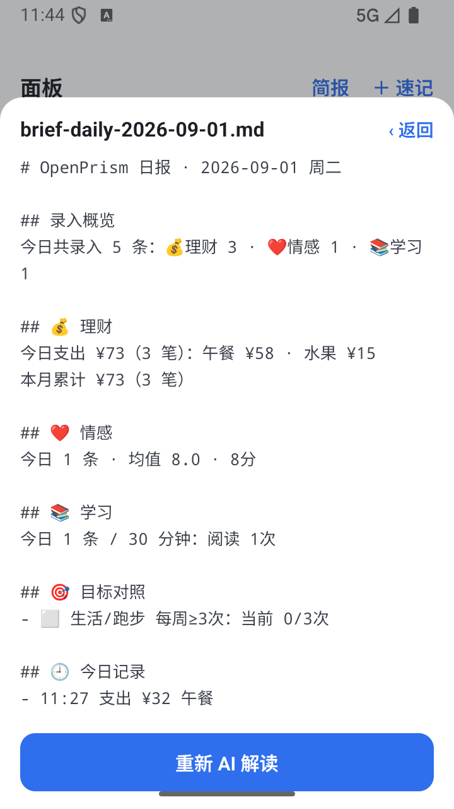
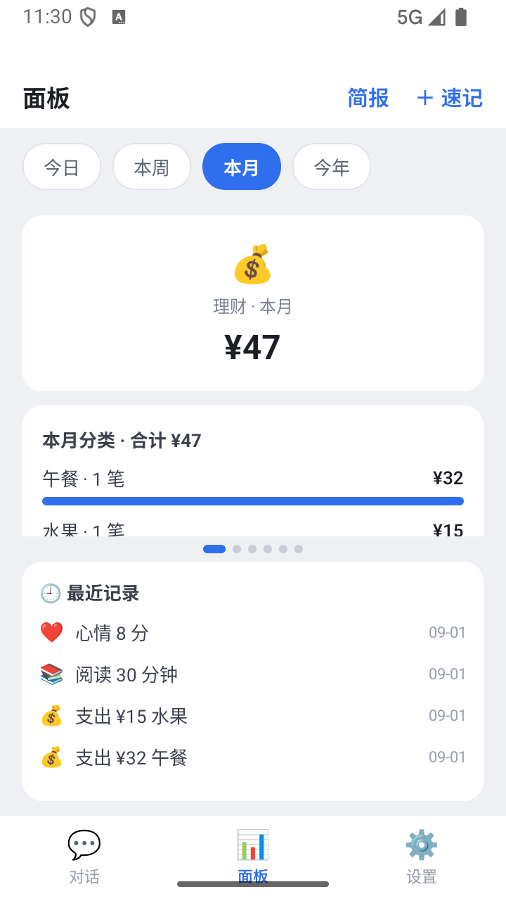
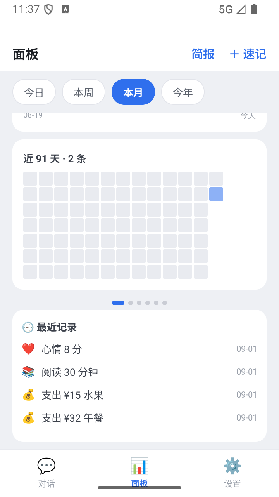
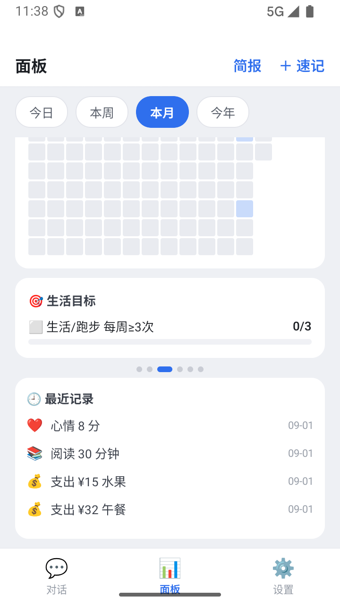
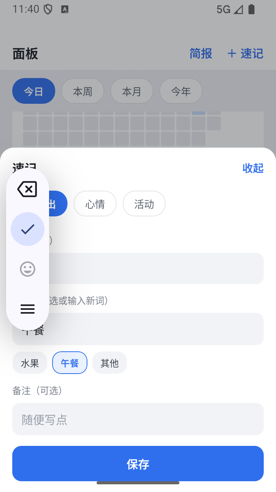

# OpenPrism

> 一个你，折射出生活的每一个维度。

OpenPrism 是一个**安卓个人生活管理 App**：和智能体聊天随手记录，数据自动沉淀为六个生活维度的统计面板；目标与预算自动对照进度；一键生成日报 / 周报。自用优先、数据全部本地、模型接入自配各厂商 API Key。

**Expo (React Native) + TypeScript** 单码库；事件溯源式仅追加日志是唯一持久层，一切统计从折叠确定性计算——数据章节零 token，不依赖模型也不怕模型算错。

## 功能一览

### 💬 对话即录入

和助手聊天就是全部操作——提到花钱、心情、做了什么，模型立刻调工具落事件并回一句确认；记错了自然语言更正，分类随口说、系统自动创建（零预设，想怎么分就怎么分）。

| | |
|---|---|
|  |  |

*左：一次对话同时落两笔支出，工具调用与月度合计实时可见；右：厂商配置——通用 OpenAI 兼容协议，内置 DeepSeek / GLM / Qwen / Moonshot / OpenRouter 预设，API Key 存系统加密存储（SecureStore），不上传任何地方。*

### 📊 六维度面板

理财 / 情感 / 生活 / 工作 / 家庭 / 学习各一页，左右滑动切换；周期切片（今日 / 本周 / 本月 / 今年）一键切换口径。

| | |
|---|---|
|  |  |

*理财页：月合计、分类条形、近 14 天趋势、91 天热力图（颜色深浅 = 当日记录数）。*

| | |
|---|---|
|  |  |

*目标进度条：组合式指标（维度 × 分类 × 聚合轴 × 周期），进度从折叠直接出，可解释、零 token；速记表单：不想聊天时三击入库（`source: 'ui'`），分类自动联想已有词。*

### 📝 简报（日报 / 周报）

| | |
|---|---|
|  |  |

*数据章节（录入概览 / 理财 / 情感 / 各维度 / 目标对照 / 明细）从事件折叠确定性生成；「AI 解读」可选，用你配置的模型追加一段温和观察与一条建议，随简报一起存档为 markdown。*

### 🎯 组合式目标（M8）

目标 = 维度 × 分类（可选）× 聚合轴（条数 / 金额 / 时长）× 数量 × 周期（日 / 周 / 月 / 年）× 单次 / 滚动，可带锚定日（偏好日，督导时机用，不构成硬约束）。例：

- 「每周运动三次」→ 生活 × 运动 × 条数 ≥ 3 / 周
- 「月支出别超 3000」→ 理财 × 金额 ≤ 3000 / 月
- 「这周写两篇文章」→ 学习 × 写作 × 条数 ≥ 2 / 单次窗口

## 架构

```
对话 UI（RN）─▶ agent 循环 ─▶ OpenAI 兼容客户端 ─▶ 各厂商 API
                   │ 工具执行（录入 ×3 / 更正 / 目标 / 面板查询）
                   ▼
        事件日志（events.jsonl，App 私有目录，唯一持久层）
                   │ 折叠（更正链 / 分类改名链 / 目标进度）
                   ▼
         面板 UI / 速记表单 / 简报 markdown
```

- **事件溯源**：六种事件（支出 / 心情 / 活动 / 更正 / 分类操作 / 目标）仅追加、按 id 幂等、双时间戳（发生 / 录入）；改错是追加更正而非改写历史。
- **折叠**：事件 → 有效记录 / 分类清单 / 目标进度的纯函数，确定性可单测；面板与简报的数据章节全部由此产出。
- **存储**（M3）：文件系统 + JSONL 为正典（导出备份即分享文件），SecureStore 存密钥；EventStore 收在窄接口（`append` / `loadAll`）之后，真机验证若有需要可换 SQLite 后端。
- **agent 循环**（M6）：消息 → 工具调用 → 执行 → 回灌直至收敛，不依赖 UI（为批次 3 的无头定时任务预留同一循环）。

领域语言见 [CONTEXT.md](CONTEXT.md)；设计决策见 [设计纪要 2026-09](docs/design/2026-09-mobile-app.md) 与 [docs/adr/](docs/adr/)。

## 快速开始

```sh
pnpm install
pnpm typecheck     # tsc --noEmit
pnpm test          # vitest（领域层纯函数单测）
pnpm start         # Expo 开发服务器（Expo Go 扫码预览）
```

> pnpm 需要 `.npmrc` 的 `node-linker=hoisted`（已随库提供）。

构建自用 APK（Windows 本机，Gradle 镜像与 JDK 17 工具链注意事项详见 [docs/dev-android.md](docs/dev-android.md)）：

```sh
npx expo prebuild -p android --no-install   # 生成 android/（已 gitignore）
cd android
export JAVA_HOME="/d/software/Android Studio/jbr"
./gradlew assembleRelease --console=plain \
  -Dorg.gradle.java.installations.paths="D:/software/jdk-17.0.20.1+1" \
  -Dorg.gradle.java.installations.auto-download=false
adb install -r android/app/build/outputs/apk/release/app-release.apk
```

## 数据与隐私

- 所有数据在 App 私有目录（`documents/openprism/`）：`events.jsonl`（事件）、`sessions/`（会话日志）、`reports/`（简报）、`providers.json`（厂商配置）。
- API Key 只存 SecureStore（系统加密存储），仅发送给你自己配置的 baseURL。
- 无账号、无云服务、无遥测；卸载即数据清零，导出即拷贝文件。

## 路线图

| 批次 | 内容 | 状态 |
|---|---|---|
| 0 | 删库重写开基（Expo 脚手架 + EventStore） | ✅ |
| 1 | 引擎：LLM 客户端 + agent 循环 + 录入工具 + 对话 UI | ✅ |
| 2 | 面板成品化 + 速记表单 + 手动简报 + AI 解读 | ✅ 交付第一批 |
| 3 | 定时任务（自然语言指令）+ 本地通知 + 目标督导物化 + 复盘推送 | 计划中 |

采集 / 提炼管线（always-record → 夜间提炼）与连接器（Chatlog、微信通道）列为后续演进。

## 前史

v0.4 之前本项目是 dsh（DeepSeek Harness）插件，2026-09 按 [ADR 0004](docs/adr/0004-mobile-app-rewrite.md) 推翻、移动端重写。插件时代终态见 `dev` 分支（`f54c8ec`，68 测试绿）；事件日志格式不变，旧 `~/.dsh/openprism/events.jsonl` 可导入。

## License

MIT
