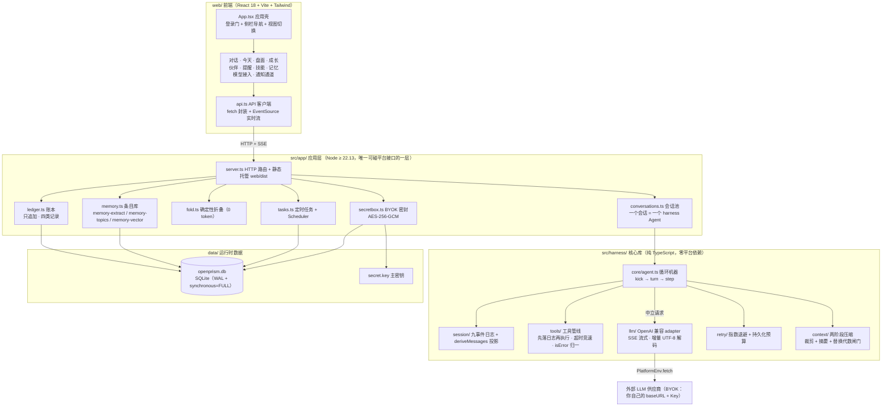
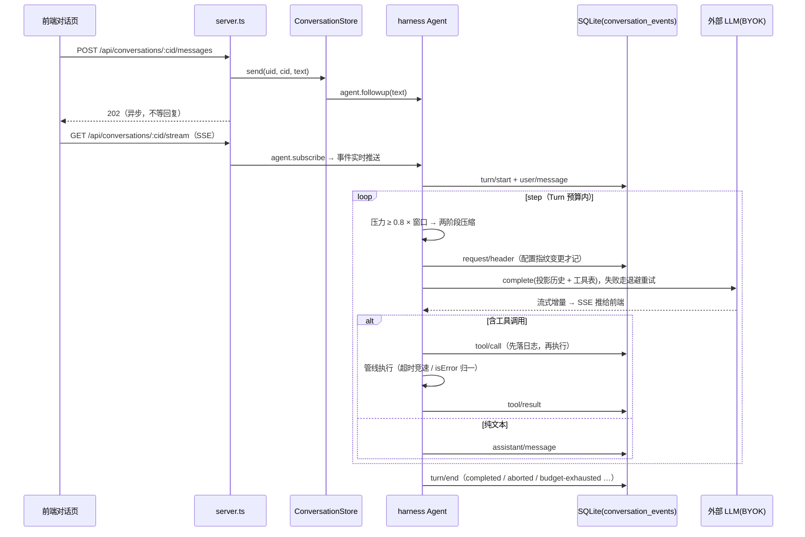

<p align="center">
  <a href="https://github.com/WLH55/OpenPrism/blob/main/LICENSE">
    
  </a>
  <a href="https://nodejs.org/">
    
  </a>
  
  
</p>

<p align="center">
  <h4 align="center">

  [项目介绍](#-项目介绍) • [核心特性](#-核心特性) • [架构设计](#-架构设计) • [快速开始](#-快速开始) • [API 一览](#-api-一览) • [开发指南](#-开发指南) • [文档](#-文档)

  </h4>
</p>

# 💡 OpenPrism — 会记录、会督促、记得你的自托管生活助理

## 📌 项目介绍

**OpenPrism** 是一个可以自己部署的个人 AI 生活助理：聊天里说的每一笔花销、每一次运动、每一个心情，都会经由工具落进一本只追加的账本；账本折叠出的今天页、盘面页、成长页随时可查；提醒到点由助理本人以它自己的身份开一次离线回合，读账本、写落账、把话留在专属会话里；长期记忆跨会话、跨伙伴记住你这个人。整套东西跑在你自己的一台机器上，数据留在你自己的一个数据库文件里。

仓库分两层：底层 **`src/harness/`** 是一个纯 TypeScript 的 agent 循环引擎（零平台依赖、平台能力全部经 `PlatformEnv` 注入，机制按 dsh（DeepSeek Harness）复刻）；上层 **`src/app/`** 是装配这个引擎的 Node 应用，配套 **`web/`** 一个 React 单页前端。两层之间只有两条缝：harness 经 `PlatformEnv` / `FileIO` / `SessionLog` 取得平台能力，前端经 HTTP 与 SSE 和应用层通信。

应用围绕五件事展开：

- **记录生活**——对话即录入。模型写账本只有一条通道：工具。参数不合骨架 schema 当场返回 `isError`，不存在"模型自己写文件、记录静默丢失"这条路。
- **监督进步**——计划覆盖日 / 周 / 月 / 年 / 最近 N 天 / 截止日，打卡闭环，连续天数、完成率、周环比、14 天趋势四个可计算指标，全部由账本确定性折叠得出，不烧一个 token。
- **陪伴聊天**——多个伙伴（智能体），每个 = 人设卡（一整篇自由 markdown）+ 能力绑定（工具开关 / 技能 / MCP）。一个会话默认绑一个伙伴，会话里随时切换，历史不丢，每条回复归属它当时的伙伴。
- **长期记忆**——跨会话、跨伙伴共享的条目式记忆：每条独立成行，`kind`（画像 / 偏好 / 事实 / 任务 / 兴趣）× `status`（生效中 / 待确认 / 已被更新 / 已归档）× `origin`（显式 / 提取 / 手动）三轴生命周期；矛盾用 supersede 链处理、不物理删除；用户删除走墓碑，防止被下一次蒸馏复活；推断出来的条目只进待确认，永不注入。注入 = 常驻块 + 按当前话题的召回（词法与向量按 RRF 名次融合，可选），整体封在 `<user_memory>` 信封里。
- **定时提醒**——单次或周期（每天 HH:MM / 每周几 / 每月几号 / 每年某日 + cron 逃生门），全部按用户时区求值。到点 = 以该伙伴的身份开一次离线回合：可以读账本、可以落账、可以结合历史说人话；用户对通知的回复直接进同一个任务会话，上下次唤醒看得到上次的痕迹。

模型接入走 **BYOK**：`baseURL` + Key 由你自己填，Key 只以 AES-256-GCM 密文落盘（主密钥在 `data/secret.key`，已 gitignore），接口永不回传明文，明文只发往你自己配置的 `baseURL`。

## ✨ 最近更新

- **记忆主题计数与向量召回** — 记忆条目附带的话题走三级归一（精确 → 字面模糊 → 模型裁决），计数达阈值自动晋升为"兴趣"条目；接入 embedding 提供方后，召回从纯字面升级为余弦扫描 + 词法结果按 RRF 名次融合，查询向量带缓存，启动时回填历史条目向量，向量侧失败自动退回纯字面召回。
- **记忆机制条目化重构** — 长期记忆从四槽 markdown 换成条目库（`kind` × `status` × `origin`），采用条目模型；提取改为对话后约 90 秒去抖的后台蒸馏，决策制产出 add / update / delete，每晚 2–5 点窗口做一次整理（合并冗余、过期归档、陈旧降级）。
- **存储引擎 SQLite 化（ADR 0008）** — 应用层持久层从 append-only JSONL 换成 SQLite（Node 内置 `node:sqlite`），13 张以上领域表；启动只载用户表，账本、会话、任务按 uid 懒加载；备份用 `VACUUM INTO`。切换前的 `*.jsonl` 数据在首次启动时导入一次，原文件保留。
- **多模型接入** — 供应商从"一个全局配置"扩成列表（`model_providers`），可分 chat 用途与 embedding 用途；会话可单独绑定某个供应商，adapter 每次调用现读配置，改完设置下一回合即生效，不需要重启。
- **伙伴五步向导与形象编辑** — 建伙伴从填表单换成走一遍向导；人设模板、形象编辑进入前端。
- **账本修正回路补齐** — `void_flow`（按 seq 作废流水）、`cancel_plan`（按 planId 作废计划）、`query_ledger` 输出带 seq 作凭据；模型侧与界面侧共用同一个作废原语。
- **任务 CRUD 补齐** — 模型侧从"只能建"补齐 `query_tasks` / `update_task` / `delete_task`，界面上能做的操作在对话里都能做。
- **聊天页体验** — Markdown 渲染、思维链折叠展示、工具回执气泡、SSE 流式增量与心跳。

## 🏗️ 架构设计



**两条缝**：

| 缝 | 接口 | 应用层实现 | 作用 |
|---|---|---|---|
| 平台能力 | `PlatformEnv` / `FileIO`（`src/harness/env.ts`） | `src/app/env.ts` 的 `nodeEnv` / `nodeFileIO` | `fetch`、时钟、随机 id、文件读写——核心库保持零平台依赖 |
| 会话日志 | `SessionLog`（`src/harness/session/log.ts`） | `src/app/session-log.ts` 的 `SqliteSessionLog` | 九类事件完整原文落 `conversation_events`，`seq` 崩溃重启后从库里续排 |

**一条消息的链路**：



## 🧩 核心特性

**对话与记录**

| 能力 | 说明 |
|---|---|
| 流式对话 | SSE 增量推送，25 秒心跳；思维链折叠展示，工具调用以回执气泡呈现 |
| 对话即录入 | 说"午饭 35"就落一笔流水；六个账本工具覆盖录入、查询、作废 |
| 写入同源 | 模型写账本只能经工具（参数 schema 校验、失败 `isError` 可见）；界面是另一写入方，两者共用同一作废原语 |
| 会话池 | 一个会话 = 一个 harness Agent 实例；切伙伴只换 prompt 与装配，历史不丢，切换处画分割线 |
| 伙伴热更 | `systemPrompt()` 每步重新合成（人设 → 日期 → 记忆块 → 行为纪律），改完下一步即生效 |

**账本与面板**

| 能力 | 说明 |
|---|---|
| 账本 | 每用户一本只追加日志，四类记录：流水 / 计划 / 打卡 / 作废；串行写队列，并发追加不交错 |
| 更正回路 | 作废 = 追加一条 `void` 引用 `targetSeq`，折叠时滤掉；历史留痕、可反悔、可审计 |
| 今天页 | 今日流水时间序 + 计划覆盖判定 + 当天最新打卡态 + 分类合计 + 连续天数 |
| 盘面页 | 分类即维度：目录从实际记过的流水动态长出，零预设、零配置；汇总卡 / SVG 折线 / 30 天热力图 / 本月明细 |
| 成长页 | 连续天数、计划完成率、周环比、近 14 天趋势、近 30 天补零序列 |
| 零 token 折叠 | 面板全部是账本数据的纯函数，不调用模型；同输入同输出 |

**记忆**

| 能力 | 说明 |
|---|---|
| 条目库 | 单条上限 300 字，`kind` 五类、`status` 四态、`origin` 三类；生效中条目有容量上限，超出按确定性排名淘汰 |
| 提取 | 对话后约 90 秒去抖触发，按水位线取新增片段，决策制产出增 / 改 / 删；解析失败不落盘 |
| 每日整理 | 本地时间 2–5 点窗口且距上次 ≥20 小时，合并冗余、过期归档、陈旧降级；启动时补跑一次 |
| 主题晋升 | 提取时附带的话题经三级归一计数，达阈值（默认 3）晋升为"兴趣"条目 |
| 召回 | 常驻块（画像 / 偏好 / 兴趣 + 全部显式条目）+ 按当前话题的情境召回；有 embedding 时与词法结果按 RRF 名次融合，向量侧失败退回纯字面 |
| 用户可控 | 记忆页可看、可改、可删、可确认后者驳回待确认条目、可手动重跑提取与整理、可导出 |

**伙伴、技能与 MCP**

| 能力 | 说明 |
|---|---|
| 伙伴 | 三段配置：人设卡（自由 markdown，名字从首个一级标题推导）+ 能力绑定（工具开关 / 技能 / MCP）+ 记忆注入（全局共享一份） |
| 技能 | 标准 Agent Skill（`SKILL.md`）；渐进式加载——目录层常驻 system prompt，正文经 `load_skill` 按需载入，载入动作本身落日志 |
| MCP | 远程 URL 型（Streamable HTTP JSON-RPC），安装时连接一次、绑定即授权；公网形态禁本地命令型 |
| 五步向导 | 建伙伴走向导，形象与人设模板可编辑 |

**提醒与通知**

| 能力 | 说明 |
|---|---|
| 定时任务 | 四字段：所属伙伴 + 触发时刻 + 任务指令（自然语言）+ 启用开关；单次与周期两类，界面对话双入口 |
| 离线回合 | 到点以该伙伴身份开一次同权回合，投给模型的是触发上下文（任务内容 + 重复规则 + 计划与触发时刻），避免模型把到点指令当成用户刚说的话 |
| 任务会话 | 一个任务一条专属持久会话，纵向记忆；通知回复也进这条会话，打卡闭环在同一个地方闭合 |
| 补跑不补吵 | 锚点 = 上次执行时间；错过不足 24 小时补跑最近一次，更久只记 `skipped` 并推进锚点，不堆积不半夜吵人 |
| 通知 | 站内通知永远在线的兜底通道；通道是可插拔的单一函数缝，未读徽标 15 秒轮询 |

**平台**

| 能力 | 说明 |
|---|---|
| 多用户 | 注册登录（scrypt 慢哈希 + 常量时间比较），登录会话令牌重启不掉线；按 uid 隔离全部数据 |
| BYOK | 多供应商列表，chat 与 embedding 分用途；adapter 每次调用现读配置；连接测试按钮发一次最小请求 |
| 数据形态 | 一个 SQLite 文件 + 一把主密钥；备份用 `VACUUM INTO`；旧版 JSONL 首启自动导入 |
| 部署 | 本机、局域网、公网共用同一份代码；环境变量 `OP_DATA` / `OP_PORT` / `OP_DB` |
| 硬化 | 静态托管前缀校验防目录穿越、安全响应头、请求体 1 MiB 上限、注册与登录限速、Cookie `HttpOnly; SameSite=Lax` |

## 🚀 快速开始

### 🛠 环境要求

- **Node.js ≥ 22.13**（应用层使用内置 `node:sqlite`，该版本起无需实验标志）
- **pnpm**（仓库用 pnpm 工作区管理 `web/`）
- 仓库根有 `.npmrc` 指向项目内安装，`pnpm install` 直接可用

### 📦 安装与启动

```bash
git clone https://github.com/WLH55/OpenPrism.git
cd OpenPrism
pnpm install
pnpm build:web     # 构建前端到 web/dist，应用层启动时静态托管它
pnpm start         # 启动服务，默认 http://127.0.0.1:8787
```

打开 **http://127.0.0.1:8787** ，先注册一个账号，再到「模型接入」页填你自己的 `baseURL`、模型名与 Key（DeepSeek / GLM / Qwen / Moonshot / OpenRouter / 任何 OpenAI 兼容端点都可以），点一次连接测试，然后就能开聊了。

> `pnpm start` 会用 `tsx` 直接跑 TypeScript 源码，不需要编译步骤。想让改动自动重启，用 `pnpm dev:server`。

### 🔧 环境变量

| 变量 | 默认值 | 说明 |
|---|---|---|
| `OP_PORT` | `8787` | HTTP 监听端口 |
| `OP_DATA` | `./data` | 数据目录；主密钥 `secret.key` 落在这里 |
| `OP_DB` | `{OP_DATA}/openprism.db` | SQLite 数据库文件路径 |

数据库为空、且 `OP_DATA` 目录里还留着切换 SQLite 之前的 `*.jsonl` 与 markdown 数据时，首次启动会做一次导入，靠 `meta` 表标记做到幂等；原文件原样保留、不删除。

### 💾 备份与升级

```bash
# 备份：WAL 模式下不要裸拷数据库文件，用 VACUUM INTO
sqlite3 data/openprism.db "VACUUM INTO 'backup-2026-09-23.db'"

# 升级
git pull
pnpm install
pnpm build:web
pnpm start
```

数据全在 `OP_DB` 指向的单个文件里，连同 `data/secret.key` 一起拷走即可整体迁移。

### 🧑‍💻 前端开发模式

```bash
pnpm dev:server   # 应用层，tsx watch，改源码自动重启
pnpm dev:web      # Vite 开发服务器，前端热更新，按提示的地址访问
```

## 🔌 API 一览

全部接口是 JSON over HTTP，会话鉴权走 Cookie（`HttpOnly; SameSite=Lax`），聊天实时流走 SSE。前端客户端 `web/src/api.ts` 的类型定义与路由一一对应，是最完整的用法参照。

| 分组 | 端点 |
|---|---|
| 健康检查 | `GET /api/health` |
| 认证 | `POST /api/auth/register`、`POST /api/auth/login`、`POST /api/auth/logout`、`GET /api/auth/me` |
| 模型接入 | `GET\|POST /api/models`、`PUT\|DELETE /api/models/:id`、`PUT /api/models/:id/active`、`POST /api/models/:id/test` |
| 会话 | `GET\|POST /api/conversations`、`DELETE /api/conversations/:cid`、`POST /api/conversations/:cid/title`、`GET /api/conversations/:cid/events`、`POST /api/conversations/:cid/messages`、`GET /api/conversations/:cid/stream`、`GET /api/conversations/:cid/meta`、`PUT /api/conversations/:cid/agent`、`PUT /api/conversations/:cid/model` |
| 账本 | `GET /api/today`、`POST /api/flows`、`POST /api/void`、`POST /api/checkin` |
| 面板 | `GET /api/panels`、`GET /api/panels/category/:name`、`GET /api/panels/progress`、`POST /api/panels/merge`、`POST /api/panels/archive`、`POST /api/panels/unarchive` |
| 伙伴 | `GET\|POST /api/agents`、`GET\|DELETE /api/agents/:id`、`PUT /api/agents/:id/persona`、`PUT /api/agents/:id/identity`、`PUT /api/agents/:id/binding` |
| 技能与 MCP | `GET\|POST /api/skills`、`GET /api/skills/:id/body`、`DELETE /api/skills/:id`、`GET\|POST /api/mcps`、`POST /api/mcps/:id/tools`、`DELETE /api/mcps/:id` |
| 记忆 | `GET /api/memory`、`PATCH /api/memory/config`、`GET\|POST\|DELETE /api/memory/items`、`PUT\|DELETE /api/memory/items/:id`、`POST /api/memory/items/:id/confirm`、`POST /api/memory/items/:id/reject`、`POST /api/memory/extract`、`POST /api/memory/consolidate`、`GET /api/memory/export`、`GET /api/memory/topics`、`POST /api/memory/topics/:key/promote`、`DELETE\|POST /api/memory/topics/:key` |
| 提醒与通知 | `GET\|POST /api/tasks`、`PUT\|DELETE /api/tasks/:id`、`POST /api/tasks/:id/run`、`GET /api/tasks/:id/runs`、`GET /api/notifications`、`POST /api/notifications/read` |

## 🧱 作为库使用

harness 不绑定任何宿主，可以单独拿去跑：

```ts
import { createAgent, createOpenAICompatAdapter } from "openprism";

// 平台能力注入：Node、React Native、浏览器各接一份 PlatformEnv 即可
const env = { fetch, now: Date.now, randomUUID: crypto.randomUUID };

const adapter = createOpenAICompatAdapter(env, {
  baseURL: "https://api.deepseek.com/v1",
  apiKey: "sk-...",   // 只来自你的配置，库不存储、不上传
});

const agent = createAgent({
  env,
  adapter,
  model: { provider: "deepseek", model: "deepseek-chat", contextWindow: 64_000 },
  systemPrompt: () => "你是一个助手。",   // 每步重新取，动态上下文的正缝
  tools: [],
});

agent.subscribe(console.log);      // 活体事件流（text-delta 只走这里，不落日志）
agent.followup("你好");             // 开一个新 Turn
agent.steer("顺便换个话题");         // 插入当前 Turn 的下一步
agent.inject("背景：用户在上海");    // 静默捎带，不唤醒
await agent.whenIdle();
```

六个模块各管一摊：`core` 循环机器（kick → turn → step 三层状态机、Inbox 三通道、Turn 预算、abort 保留部分输出）、`llm` 错误归一与 OpenAI 兼容 adapter、`session` 九事件日志与投影、`retry` 退避与持久化预算、`tools` 工具契约与执行管线、`context` token 计量与两阶段压缩。模拟适配器（`llm/mock.ts`）让全部测试零网络。

## 🧭 开发指南

### 常用命令

```bash
pnpm install       # 安装依赖（仓库本体只要 TypeScript、tsx、vitest；前端依赖在 web/）
pnpm test          # vitest 全量：29 个测试文件，零网络、时钟与随机全注入，确定性
pnpm typecheck     # tsc --noEmit
pnpm build:web     # 构建前端
pnpm dev:server    # 应用层开发模式（tsx watch）
pnpm dev:web       # 前端开发模式（Vite）
```

### 真实厂商冒烟

默认跳过，靠环境变量或仓库根 `.env.local`（已 gitignore）开启：

```bash
SMOKE_BASE_URL=https://api.deepseek.com/
SMOKE_API_KEY=sk-...
SMOKE_MODEL=deepseek-chat
pnpm test
```

开启后跑三条真实往返：流式中文文本（增量拼接等于最终文本、usage 归一）、工具调用两步往返、流中途取消（`ABORTED` 部分保留）。

### 工程铁律

1. **零平台依赖**——`src/harness/` 不许 import 任何 Node / React Native / 浏览器专属模块；平台能力一律经 `src/harness/env.ts` 的 `PlatformEnv` / `FileIO` 注入。
2. **模型见过的必须可重建**——发给模型的内容都要能从会话日志重建（`deriveMessages` 投影）；新增模型可见的东西，等于新增日志事件或在投影里确定性推导。`test/invariants.test.ts` 守护这条不变量。
3. **工具调用与结果不可悬空**——任何路径（取消、Turn 预算用尽、管线出错）离开 step 之前，未回话的工具调用必须补上合成的 `isError` 结果。
4. **错误归一边界**——adapter 之外的代码看不到厂商原始错误形态，一律 `LlmFailure` 十码表（`AUTH` / `QUOTA` / `RATE_LIMIT` / `SERVER` / `TIMEOUT` / `TRANSPORT` / `EMPTY_RESPONSE` / `CONTEXT_WINDOW_EXCEEDED` / `INVALID_REQUEST` / `ABORTED`）。新错误情形先归码，再谈处理。
5. **确定性测试**——测试零网络（模拟适配器）、时钟与随机全注入固定值；不写真实计时断言。
6. **快失败**——出错就地抛，不吞、不降级掩盖。

改动落在 `src/harness/` 时以上六条全部适用；`pnpm test` 与 `pnpm typecheck` 保持全绿再交付。

## 🔒 安全说明

- **Key 政策**：BYOK。Key 只以 AES-256-GCM 密文落盘，主密钥在 `data/secret.key`（已 gitignore，切勿入库或分享）；接口只回传"是否已配置"，永不回传明文。
- **部署位置**：公网暴露前请确认已经配好反向代理与 HTTPS、限制注册入口，并按需收紧登录限速；自用场景建议只监听局域网或本机。
- **信任边界**：技能是改提示词（低危），MCP 是把数据外发给第三方（中危）——安装时告知一次，绑定即授权，运行中不逐次审批。公网形态禁用本地命令型 MCP。
- **无审批与沙箱**：本项目的 harness 不含审批、沙箱、文件写入意图门（设计上刻意排除，理由见 ADR 0006）。应用层给模型的工具只有账本、技能、记忆与任务四组，没有执行任意命令或写任意文件的能力。
- **数据主权**：全部数据在 `OP_DB` 指向的单个 SQLite 文件里，随时可整包带走。

## 🤝 参与贡献

欢迎提 [Issue](https://github.com/WLH55/OpenPrism/issues) 或 Pull Request。

**流程**：Fork → 建分支 → 提交改动 → 开 PR

**规范**：提交信息用 Conventional Commits（`feat:` / `fix:` / `docs:` / `test:` / `refactor:`）；注释与文档用中文，标识符保持英文；术语以 `CONTEXT.md` 为准，不发明同义词。

**交付门槛**：

```bash
pnpm test          # vitest 全量
pnpm typecheck     # 零错误
```

涉及前端改动时加跑 `pnpm --dir web typecheck`。

## 📄 许可证

本项目使用 [MIT 许可证](./LICENSE)，保留署名即可自由使用、修改与分发。

## 📚 文档

| 文档 | 内容 |
|---|---|
| [docs/design/2026-09-harness.md](./docs/design/2026-09-harness.md) | 权威规格：harness 十二节设计，含与 dsh 的刻意差异清单 |
| [docs/design/2026-09-app.md](./docs/design/2026-09-app.md) | 应用功能设计纪要，逐条决策与理由 |
| [docs/design/2026-09-app-implemented.md](./docs/design/2026-09-app-implemented.md) | 实现汇报：每个功能的原理、代码位置与实现要点 |
| [docs/architecture.md](./docs/architecture.md) | 三层架构图与消息链路、记忆管线 |
| [docs/2026-09-structure.md](./docs/2026-09-structure.md) | 逐文件代码结构说明 |
| [CONTEXT.md](./CONTEXT.md) | 领域术语表（harness 与 app 两节） |
| [docs/adr/](./docs/adr/) | 架构决策记录 |
| [AGENTS.md](./AGENTS.md) | 参与本仓库开发的约定与铁律 |
