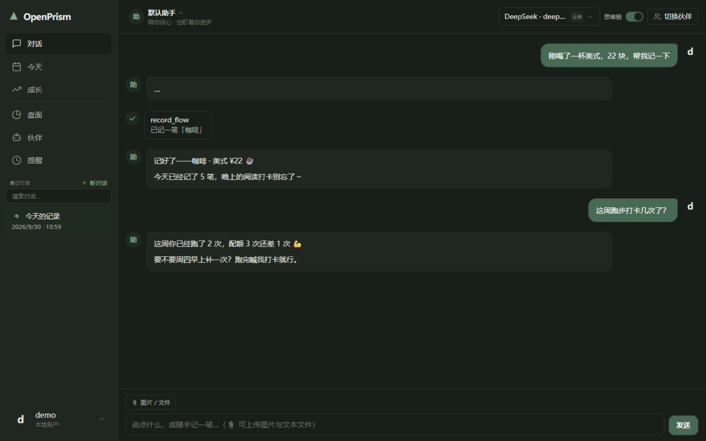
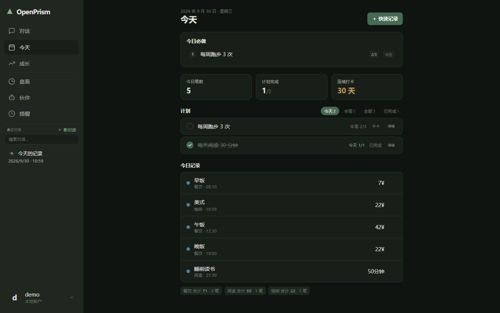
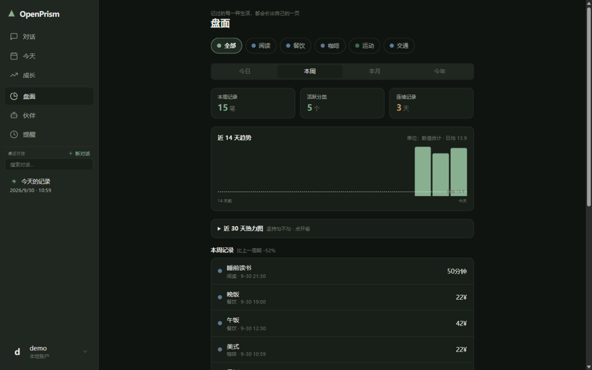
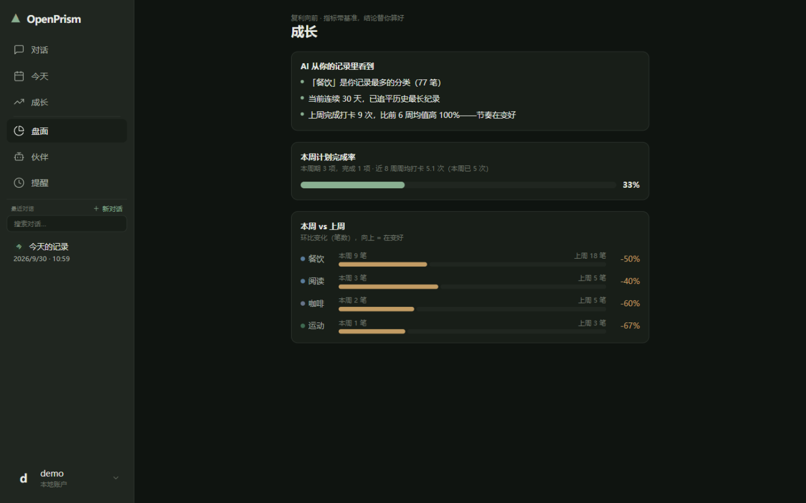
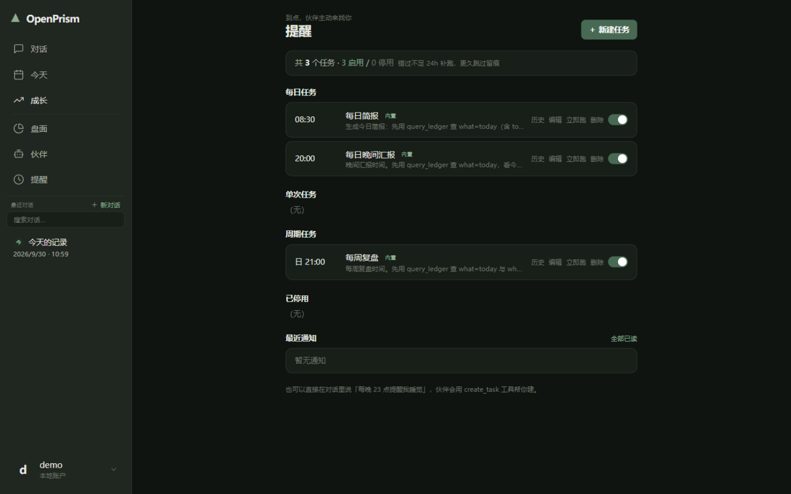
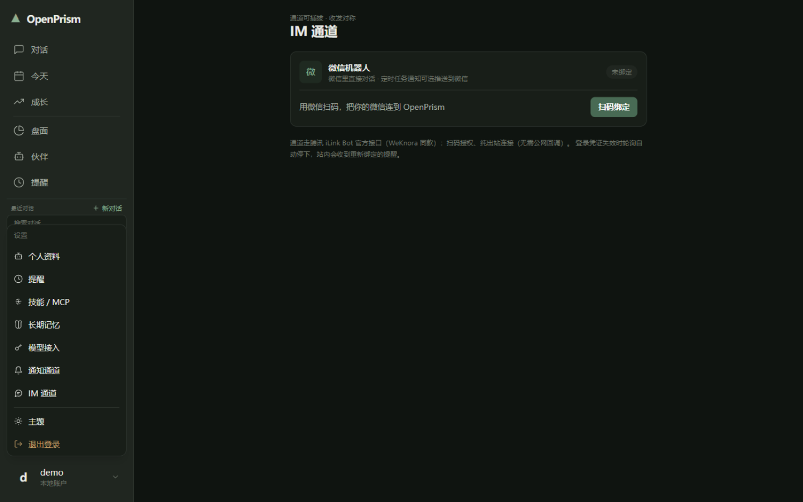

<p align="center">
  <a href="https://github.com/WLH55/OpenPrism/blob/main/LICENSE">
    
  </a>
  <a href="https://nodejs.org/">
    
  </a>
  
  
</p>

# 💡 OpenPrism — 会记录、会督促、真的记得你的 AI 生活助理

**OpenPrism** 是一个开源的 AI 生活助理：聊天里说的每一笔花销、每一次运动、每一个心情，都会落进一本只追加的账本；面板随时可查；提醒到点由伙伴本人来找你；长期记忆跨会话记住你这个人。它就住在你的微信里——扫码绑定后，微信直接聊、直接收提醒，不用再多打开一个 App。整套代码开源，可以跑在自己的电脑上，也可以部署到服务器开放给朋友注册使用，数据始终在你自己手里。

## 📣 为什么是 OpenPrism

你是否列满了待办事项，却因为没人提醒，一次次拖过了截止日期？

你是否办了健身卡、下载了打卡 App，热情三天后，连打开它都成了负担？

你是否记了半个月账，某天一忙忘了记，看着断掉的记录从此摆烂？

你是否也跟某个 AI 聊得很好，三天后再来，它却把你忘得一干二净？

你是否装过 AI 应用，却因为"懒得再打开一个软件"，渐渐就不用了？——明明微信一开就是一整天。

你的手机里，是否躺着记账、打卡、待办、日记……四五个 App，每个都只用了三天？

还有——你是否想过：我的账单、我的心情，凭什么交给一个看不懂也带不走的黑盒服务？

**只要有一条戳中了你，往下看三分钟。**

**01｜聊天就是记录。** 不用填表单，不用选分类。说一句"午饭 35""跑步 40 分钟""今天有点丧"，就记上了。记错了？说一声"刚才那笔记错了"，它当场作废重记，每次修改都留痕。一句话的成本，比打开任何一个记账 App 都低。

**02｜它就住在你的微信里。** 扫码绑定一次，它就成了你微信里的一个"好友"：想记一笔、想聊两句，微信里直接说；早上 8:30 的简报、晚上 8:00 的问候、周日晚的复盘，直接以微信消息推到你的聊天列表；你回复它，它接着上下文聊，网页端同步可见，两边记录都不丢。不用再打开一个新的 AI 应用——它就在好友列表里，像一个会记事、会催你、还记得你的朋友。

**03｜它会在对的时间来找你——不是闹钟，是伙伴。** 早上 8:30，一份每日简报：今天的计划、该做的事；晚上 8:00，一声晚间问候：汇报一下今天？漏的卡现在补还来得及；周日晚 21:00，一份周复盘：这周完成了什么、差了什么、下周聚焦哪件。提醒到点，是你的伙伴本人醒来：它读你的账本、看你这周做了什么，然后说人话——不是一条冷冰冰的推送文案。这三件只是注册自带的内置任务，可改可关；更常用的是自定义——「每晚 23 点提醒我睡觉」「下个月 1 号提醒交房租」，单次或周期都行，在对话里随口说一句，伙伴就帮你建好。

**04｜习惯，终于不用靠意志力。** "每周跑 3 次""每天读书半小时"——定个配额，它按周计数：跑了 2/3，晚上它来提醒你差的那一次。连续天数、完成率、周环比、趋势图、30 天热力图全自动。你的每一次坚持，都看得见。

**05｜它真的记得你。** 三周前你提过乳糖不耐，今天它就不会给你推荐奶茶。你的偏好、习惯、在意的事，沉淀成长期记忆。更重要的是：记忆页里每一条都摊开给你——可看、可改、可删。它记得你，但你说了算。

**06｜多种性格，随你挑。** 严师型、暖友型、毒舌损友型——人设自由定制，随时切换，聊天记录不丢。挑一个你愿意天天说话的。

**07｜透明，而且带得走。** 代码完全开源，每一行都摆在 GitHub 上——它怎么记、怎么存，没有黑盒；你的模型 Key 加密保存，明文绝不回传，只发往你自己配置的服务商；你的记录随时可以导出带走，不绑架、不锁定；想要彻底归自己？整套开源，一台自己的机器就能跑起来，数据完全属于你。

**自律不难，难的是没人陪你。现在，有了一个会记住你、会督促你、说到点就来的朋友。**

## ✨ 功能一览

### 对话即记录

跟伙伴聊天就是录入：说「刚喝了一杯美式，22 块」，它调用记账工具落进账本，回执当场可见。模型写数据只有工具这一条通道，参数校验失败当场报错——不存在"模型随手一写、记录静默丢失"。支持流式回复、思维链折叠、输出中途打断（打断后排队的话自动接着发）。



### 今天页：今天的全貌

今日必做（Top 3）、计划打卡（含习惯配额进度 2/3）、逾期项补做或跳过、今日流水与分类合计、连续打卡天数。计划可按 今天 / 本周 / 全部 / 已完成 四档切换；漏记的卡可以补历史卡，误打的卡可以撤销（作废留痕）。



### 盘面与成长：你的坚持，看得见

分类即维度——没有预设模板，你记过什么就长出什么。盘面页按分类出折线趋势、30 天热力图、本月明细；成长页给连续天数、计划完成率、周环比、近 14 天趋势。全部由账本确定性折叠得出，不烧一个 token。

| 盘面（分类 · 折线 · 热力图） | 成长（连续 · 完成率 · 环比） |
|:---:|:---:|
|  |  |

### 提醒：到点，伙伴主动来找你

定时任务分单次与周期（每天 / 每周几 / 每月几号 / 每年某日，另有 cron 逃生门），按用户时区求值。注册即自带三件套：**每日简报 08:30**、**每日晚间汇报 20:00**、**每周复盘（周日 21:00）**——可改可关，删除后可用模板一键重建。到点由伙伴本人开一次回合：读账本、可落账、说人话；你对通知的回复直接进同一个任务会话，下次唤醒还接得上。错过不足 24 小时补跑最近一次，更久只记跳过——不堆积、不半夜吵人。



### 微信直达

「IM 通道」页扫码绑定微信机器人（腾讯 iLink 官方接口，纯出站连接、无需公网回调）：微信里直接对话（内容进「微信对话」会话，web 端同步可见）；定时任务的通知渠道可选「微信机器人」，到点提醒直接推到微信。站内通知永远在线兜底。



### 伙伴、记忆、技能

- **多伙伴**：每个伙伴 = 人设卡（自由 markdown）+ 能力绑定（工具 / 技能 / MCP）；同一会话随时切换伙伴，历史不丢。五步向导创建，形象可编辑。
- **长期记忆**：跨会话、跨伙伴共享的条目式记忆（画像 / 偏好 / 事实 / 任务 / 兴趣），对话后后台蒸馏、每晚自动整理；记忆页可看、可改、可删、可确认、可导出——它记得你，但你说了算。
- **技能与 MCP**：标准 Agent Skill（`SKILL.md`，渐进式加载）与远程 MCP 工具（Streamable HTTP），安装即用。
- **多模型接入（BYOK）**：DeepSeek / GLM / Qwen / Moonshot / OpenRouter / 任何 OpenAI 兼容端点；Key 只以 AES-256-GCM 密文落盘，接口永不回传明文；改完设置下一回合即生效。

### 平台

- **多用户**：注册登录（scrypt 慢哈希 + 登录限速），数据按用户完全隔离——既适合自己用，也适合部署给家人朋友。
- **数据形态**：全部数据在单个 SQLite 文件里（`VACUUM INTO` 一句备份），连同主密钥一起拷走即可整体迁移。
- **手机可用**：窄屏自动切换底部标签栏布局，可「添加到主屏幕」当 App 用。
- **部署形态**：本机、局域网、公网共用同一份代码；公网部署（含 HTTPS 与风险提示）见 [docs/deployment.md](./docs/deployment.md)。

## 🏗️ 架构一瞥

仓库分三层：`src/harness/` 是纯 TypeScript 的 agent 循环引擎（零平台依赖、平台能力全部注入，机制按 dsh 复刻，也可以脱离本应用单独作为库使用）；`src/app/` 是装配引擎的 Node 应用（HTTP + SSE + 定时调度 + SQLite）；`web/` 是 React 单页前端。全应用一条主线：**账本只追加、面板 = 确定性折叠（0 token）、模型只能经工具写数据、Key 只以密文落盘**。想深入的话，[docs/](./docs) 下有架构说明、部署指南与逐文件结构，[CONTEXT.md](./CONTEXT.md) 是领域术语表。

## 🚀 快速开始

**环境要求**：Node.js ≥ 22.13（应用层用内置 `node:sqlite`）、pnpm。

```bash
git clone https://github.com/WLH55/OpenPrism.git
cd OpenPrism
pnpm install
pnpm build:web     # 构建前端
pnpm start         # 启动，默认 http://127.0.0.1:8787
```

| 环境变量 | 默认值 | 说明 |
|---|---|---|
| `OP_PORT` | `8787` | HTTP 监听端口 |
| `OP_DATA` | `./data` | 数据目录（主密钥 `secret.key` 落在这里） |
| `OP_DB` | `{OP_DATA}/openprism.db` | SQLite 数据库文件路径 |
| `OP_MAX_USERS` | `50` | 注册用户数上限（公开自部署防滥用）；`0` = 不限制 |
手机（同一 Wi-Fi）直接访问 `http://<电脑局域网地址>:8787`；部署到服务器与公网端口映射见 [docs/deployment.md](./docs/deployment.md)。

```bash
# 备份（WAL 模式下不要裸拷数据库文件）
sqlite3 data/openprism.db "VACUUM INTO 'backup.db'"
```

## 🧭 上手五分钟

1. **注册**：打开首页注册一个账号；
2. **接模型**：到「模型接入」页填你自己的 `baseURL`、模型名与 API Key（DeepSeek / GLM / Qwen / Moonshot / OpenRouter 都行），点一次「测试连接」；
3. **开始记**：对话页随口说「午饭 35」「跑步 40 分钟」；今天页也有「＋ 快速记录」表单，不经模型直接落账；
4. **收提醒**：注册时已自动建好「每日简报 / 晚间汇报 / 每周复盘」三件套，到点伙伴会来找你；也可以直接在对话里说「每晚 23 点提醒我睡觉」，伙伴会帮你建任务；
5. **绑微信**：「IM 通道」页扫码绑定，之后微信里直接聊、直接收提醒。

## 🤝 参与贡献

欢迎提 [Issue](https://github.com/WLH55/OpenPrism/issues) 或 Pull Request。

- **流程**：Fork → 建分支 → 提交改动 → 开 PR；
- **规范**：提交信息用 Conventional Commits（`feat:` / `fix:` / `docs:` / `test:` / `refactor:`）；注释与文档用中文，标识符英文；术语以 [CONTEXT.md](./CONTEXT.md) 为准；仓库约定与工程铁律见 [AGENTS.md](./AGENTS.md)；
- **交付门槛**：`pnpm test` 与 `pnpm typecheck` 保持全绿（涉及前端改动加跑 `pnpm --dir web typecheck`）。

```bash
pnpm install && pnpm test && pnpm typecheck
```

## 🙏 致谢

站在两个开源项目的肩膀上：

- **[WeKnora](https://github.com/Tencent/WeKnora)**（腾讯微信团队开源）——微信机器人（iLink）通道、长期记忆条目化、会话自动命名等功能设计借鉴自它；
- **dsh（DeepSeek Harness）**——本项目 agent 引擎（`src/harness/`）的机制蓝本：循环状态机、会话日志投影、工具管线、上下文压缩等核心机制照其设计复刻（架构另起）。

感谢它们的开源精神。

## 📄 许可证

本项目使用 [MIT 许可证](./LICENSE)，保留署名即可自由使用、修改与分发。
