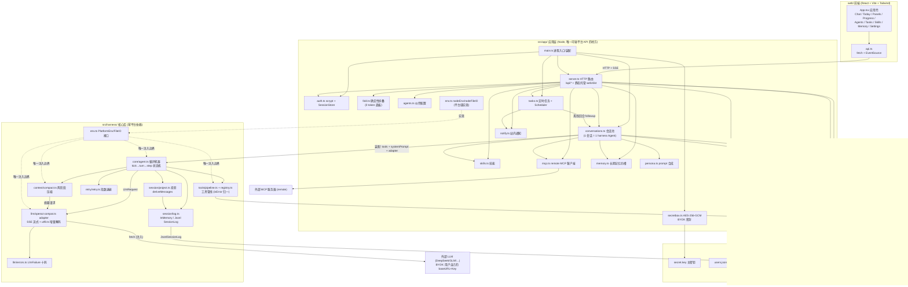
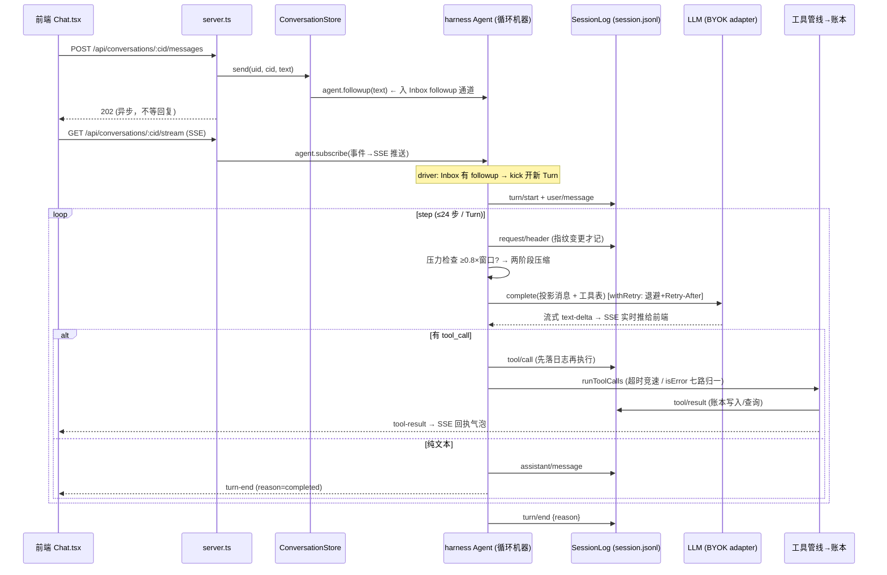
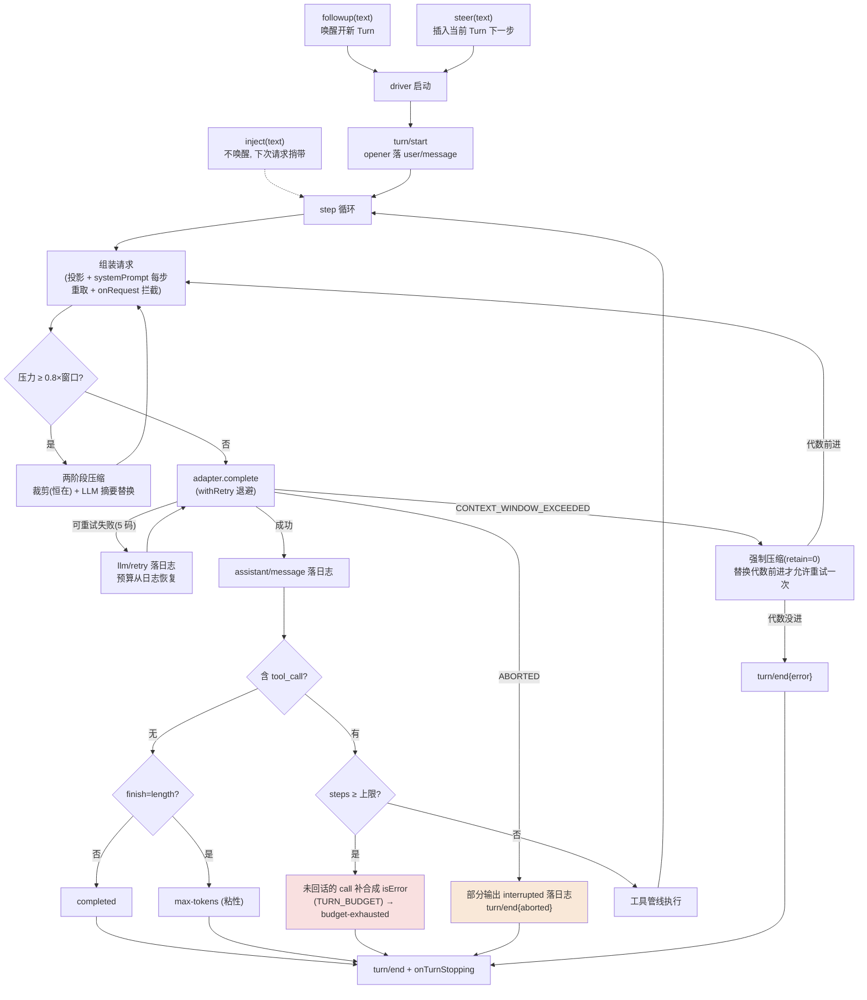
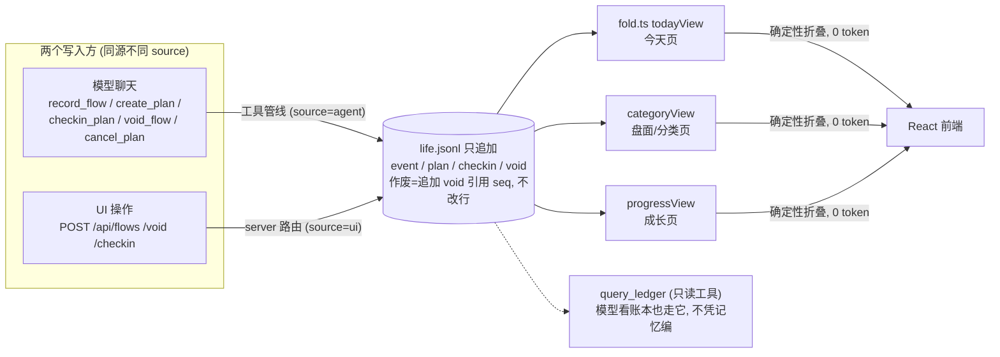

# 代码结构与架构/流程分析

> 2026-09-06 基于当前代码（分支 feat/design-standalone）的通读记录。三层结构逐文件说明 + mermaid 架构图与流程图，供新人上手与改动前定位。术语以 [CONTEXT.md](../CONTEXT.md) 为准，权威规格见 [2026-09-harness.md](2026-09-harness.md) 与 [2026-09-app.md](2026-09-app.md)。

## 总览

仓库是**三层结构**的本地生活助理应用：

- 底层 `src/harness/`：纯 TypeScript 的 agent 循环引擎（零平台依赖，机制复刻 dsh）；
- 中层 `src/app/`：Node 应用层（HTTP 服务、多用户、账本、记忆、定时任务）；
- 上层 `web/`：React 前端。

三层靠两个"缝"连接：harness 靠 `PlatformEnv` / `FileIO` 注入获得平台能力；前端靠 HTTP + SSE 与 app 层通信。

| 路径 | 作用 |
|---|---|
| `src/harness/` | **核心库**：循环机器、错误重试、上下文压缩、工具管线、会话日志。铁律：不许 import 任何 Node/浏览器专属模块 |
| `src/app/` | **应用层**：装配 harness，提供多用户 HTTP 服务、账本、人设、技能、MCP、记忆、定时任务、通知 |
| `web/` | **前端**：React 18 + Vite + Tailwind 单页应用，构建产物 `web/dist` 由 app 层静态托管 |
| `test/` | 24 个 vitest 测试文件（harness 8 个 + app 16 个），零网络、时钟注入 |
| `data/` | 运行时数据：`secret.key`（主密钥）、`users.jsonl`（用户表）、`sessions.jsonl`（登录会话）、`users/{uid}/`（每用户沙盒） |
| `docs/` | 设计文档（`2026-09-harness.md` 是权威规格）、7 篇 ADR |
| `plugins/`、`prototype/`、`mydocs/` | 未入库的旧 JS 插件版实现（2026-08 路线遗留）、HTML UI 原型、本地资料 |

## 一、src/harness/ — 核心库（六模块）

| 文件 | 作用 |
|---|---|
| `env.ts` | **平台缝**。`PlatformEnv`（fetch/时钟/UUID）+ `FileIO` 接口——核心零平台依赖的唯一例外边界，宿主各接一份实现 |
| `types.ts` | 协议中立的消息模型：`UserMessage` / `AssistantMessage`（含 reasoning、interrupted）/ `ToolResultMessage`（isError + 失败码），tool_call 与 tool_result 按 callId 配对 |
| `util.ts` | FNV-1a 哈希（请求头/工具表指纹）、默认 sleep |
| `index.ts` | 公共出口，re-export 全部模块 |
| `core/agent.ts` | **循环机器**（最核心）：kick→turn→step 三层状态机；Inbox 三通道（followup 唤醒开新 Turn / steer 插入当前 Turn / inject 静默捎带）；abort 保留部分输出；Turn Budget 用尽补合成 isError；上下文压力检查触发压缩；溢出走"替换代数"闸门重试；对外暴露 `followup/steer/inject/cancel/whenIdle/compact/subscribe` |
| `core/events.ts` | 活体事件流类型（11 种）：text-delta 只走这里不落日志，其余与日志事件一一对应 |
| `session/events.ts` | 九事件词表：turn/start、turn/end、user/message、assistant/message、tool/call、tool/result、llm/retry、compaction/summary、request/header |
| `session/log.ts` | SessionLog 接口的两个实现：`InMemorySessionLog`（默认/测试）与 `JsonlSessionLog`（写穿落盘，seq 从磁盘续排） |
| `session/project.ts` | **投影**：从日志推导模型可见历史（Surface）。跳过遮蔽区间、恒定裁剪超长工具结果（>8192 字符留头尾）——"model-visible means logged" 铁律的落点 |
| `session/queries.ts` | 从日志重放恢复运行时状态：Turn 计数、替换代数、重试预算（崩溃重启不重置）、最近请求头 |
| `llm/adapter.ts` | LlmAdapter 接口：中立请求 → 厂商协议，流式回调 onTextDelta/onReasoningDelta |
| `llm/errors.ts` | **LlmFailure 十码表**（AUTH/QUOTA/RATE_LIMIT/SERVER/TIMEOUT/TRANSPORT/EMPTY_RESPONSE/CONTEXT_WINDOW_EXCEEDED/INVALID_REQUEST/ABORTED）+ 溢出/配额文案识别。边界外不允许厂商原始错误 |
| `llm/openai-compat.ts` | OpenAI 兼容默认 adapter：SSE 流式、工具调用跨 chunk 累积、流空闲看门狗，一词覆盖 DeepSeek/GLM/Qwen 等 |
| `llm/utf8.ts` | 自写增量 UTF-8 解码器：跨 chunk 中文不截断（不依赖宿主 TextDecoder） |
| `llm/mock.ts` | Mock adapter：脚本化返回文本/工具调用/失败序列，测试零网络 |
| `retry/retry.ts` | 指数退避 + 对称抖动；Retry-After 优先；已用预算从日志恢复 |
| `tools/registry.ts` | ToolDefinition 契约（参数 schema / 输出 schema / render / execute / 超时 / 并发分类 / concludeTurn）+ 注册表 + 工具表指纹 |
| `tools/pipeline.ts` | **工具管线**：tool/call 先落日志再执行 → 硬超时竞速 → 七路失败全部 isError 化（TOOL_NOT_FOUND/ABORTED_BEFORE_DISPATCH/TOOL_TIMEOUT/ABORTED/TOOL_ERROR/TOOL_OUTPUT_INVALID/TOOL_RENDER_FAILED）→ fail-closed 并发分类 + 有界滚动池（10） |
| `tools/schema.ts` | 宽松 JSON Schema 校验器（工具输出契约检查） |
| `context/meter.ts` | 启发式 token 计量（chars/4 + 常数开销），实时压力判断用 |
| `context/compact.ts` | **两阶段压缩**：选遮蔽区间（保留尾部、不切开 tool_call 配对）→ 复用会话前缀请求 LLM 摘要（保 KV cache）→ 稳定性检查 + shrink 校验 → 提交 compaction/summary 事件 |

## 二、src/app/ — 应用层

| 文件 | 作用 |
|---|---|
| `main.ts` | **进程入口**：装配一切——数据目录 → 主密钥 → 用户表 → 会话池 → BYOK adapter 工厂（每次调用现读配置）→ HTTP 服务 → 定时调度器 → 启动惰性记忆凝练 |
| `env.ts` | Node 平台缝实现：`nodeEnv`（fetch/now/uuid）+ `nodeFileIO`（appendLine/readAll，自动建目录） |
| `store.ts` | 数据目录布局：`users/{uid}/` 下 life.jsonl（账本）、model.json（BYOK）、conversations/（会话）；uid 用 UUID 防路径遍历 |
| `auth.ts` | 注册登录：scrypt 慢哈希 + 常量时间比较；用户表追加式 JSONL；`SessionStore` 会话令牌（issue/revoke 事件持久化，重启不掉线） |
| `secretbox.ts` | BYOK 密封：API Key 以 AES-256-GCM 密文落盘，主密钥 32B 在 `data/secret.key`；model.json 原子替换写入 |
| `server.ts` | **HTTP 路由**（最大文件）：`/api/auth/*`、`/api/model`、`/api/conversations/*`（含 `/events` 全量日志、`/messages` 发消息、`/stream` SSE 活体流）、`/api/agents|skills|mcps|memory|tasks|notifications|today|flows|void|checkin|panels/*`；认证门只管 `/api/*`；静态托管 `web/dist` |
| `conversations.ts` | **会话池**（app↔harness 桥）：一个会话 = 一个 harness Agent 实例；装配时快照能力绑定（工具集），systemPrompt 每步重读（人设/记忆/技能目录热更）；`taskAgent()` 给定时任务开专属持久会话 |
| `ledger.ts` | **账本**：每用户一份只追加 `life.jsonl`，四种记录（流水 event / 计划 plan / 打卡 checkin / 作废 void）；串行写队列；作废 = 追加 void 引用 targetSeq，不原地改 |
| `fold.ts` | **确定性折叠**（零 token）：今天视图（流水+计划打卡态+streak）、分类页（30 天日序列）、进步页（完成率/周环比/14 天趋势）。全部是账本的纯函数 |
| `tools.ts` | 账本录入工具六件：record_flow / create_plan / checkin_plan / query_ledger（只读）/ void_flow / cancel_plan——模型写账本的唯一通道 |
| `persona.ts` | system prompt 合成：人设卡（H1 推名字）→ 日期 → 记忆块 → 行为纪律（"写入必须走工具"） |
| `agents.ts` | 智能体配置：persona.md（自由 markdown）+ binding.json（工具开关/技能/MCP 绑定） |
| `skills.ts` | 技能：标准 SKILL.md（frontmatter 解析）；渐进式加载——目录层常驻 prompt，正文经 load_skill 工具按需载入 |
| `mcp.ts` | MCP 客户端：仅 remote URL 型，Streamable HTTP JSON-RPC 最小实现；安装时连接测试一次，绑定即授权 |
| `memory.ts` | 长期记忆：四槽位 markdown（recent/profile/scope/preferences）；凝练 = LLM 批处理（fail-safe 解析失败不落盘）；模型写 = save_preference 窄工具（≤240 字、仅显式偏好）；注入时剥溯源脚注 |
| `tasks.ts` | **定时任务**：触发器五枚举 + 自研 cron 匹配器；补跑不补吵（错过 <24h 补最近一次，≥24h 记 skipped）；`Scheduler` 每分钟轮询；任务会话跑完把助手文本落站内通知 |
| `notify.ts` | 通知：站内 JSONL 兜底通道 + NotifyChannel 扩展缝（后续接微信桥） |

## 三、web/src/ — 前端

| 文件 | 作用 |
|---|---|
| `main.tsx` | Vite 入口 |
| `App.tsx` | 应用壳：登录门 → 左侧栏（主导航/最近对话/头像下拉）+ 内容区路由（自管 view state，非路由库） |
| `api.ts` | API 客户端：fetch 封装 + EventSource；`api`（auth/会话/账本）、`api2`（伙伴/技能/MCP/记忆）、`api3`（任务/通知）、`api4`（盘面/成长）四组按批次演进 |
| `pages/Chat.tsx` | 聊天页：`/events` 全量折叠历史气泡 + `/stream` SSE 实时增量；切换伙伴画分割线 |
| `pages/Today.tsx` | 今天页：流水/计划打卡/快捷记一笔 |
| `pages/Panels.tsx` | 盘面（分类页）：分类即维度，SVG 折线/热力图 |
| `pages/Progress.tsx` | 成长页：streak/完成率/周环比/14 天趋势 |
| `pages/Agents.tsx` | 伙伴管理 + 编辑（人设 markdown、能力绑定） |
| `pages/Tasks.tsx` | 提醒页：定时任务 CRUD + 站内通知列表（15s 轮询未读数） |
| `pages/Skills.tsx` | 技能安装/管理（粘贴 SKILL.md 内容） |
| `pages/Memory.tsx` | 长期记忆四槽编辑 + 手动凝练 |
| `pages/Settings.tsx` | 模型接入（BYOK：baseURL/Key/模型名 + 连通性测试） |
| `pages/NotifyChannels.tsx` | 通知通道页 |
| `pages/Login.tsx` | 登录/注册 |
| `ui.tsx` / `icons.tsx` / `catcolor.ts` / `theme.css` | 通用组件、SVG 图标、分类配色、主题 token |

## 四、架构图

## 五、流程图

### 1. 一条用户消息的完整旅程（聊天主链路）

### 2. Turn/Step 状态机与异常路径

### 3. 数据流：账本是唯一真相，面板是折叠

## 六、支撑部分

- **`test/`**：harness 侧 8 个文件守护核心不变量——`invariants.test.ts` 守"每条发出的请求都能从日志前缀重建"（model-visible means logged）与 tool_call/result 配对完整性；`core-loop.test.ts` 覆盖三通道/abort/预算；app 侧 16 个文件按 store/server 路由逐模块覆盖。全部 mock adapter、零网络、时钟注入。
- **`data/`**：运行时数据已 gitignore（`secret.key` 是 32B 主密钥）。每用户一个 UUID 目录沙盒，会话日志就是 harness 的九事件 JSONL。
- **`plugins/openprism/`**：未入库的旧版 JS 实现（2026-08 插件路线，briefing/panel/distill 等），已被当前 TS 重写推翻，仅存档参考。
- **`docs/`**：`design/2026-09-harness.md` 是权威规格（12 节，§12 列了对 dsh 的六条刻意差异）；`2026-09-app.md` 是应用层功能设计；ADR 0001–0007 记录架构决策。

## 一句话总结

**harness 是一台"日志即真相"的循环机器，app 层把它装配成多用户生活助理（账本工具 + 记忆 + 人设 + 定时任务），web 只是这棵状态树的投影视图**——聊天走 SSE 活体流，面板走零 token 的确定性折叠。
