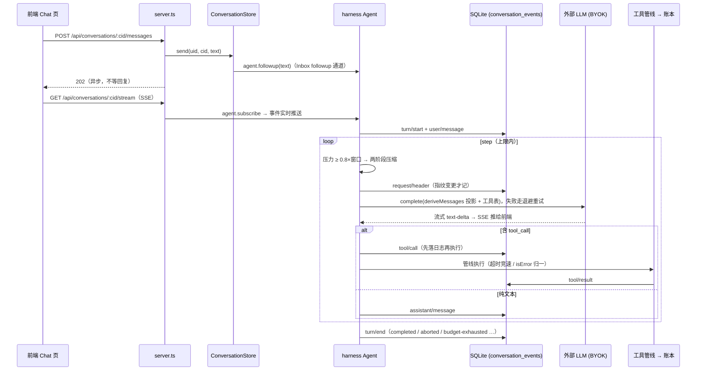
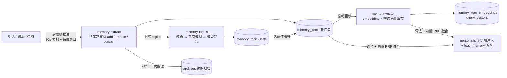

# OpenPrism 架构图

> 基于分支 feat/design-standalone 当前代码（提交 22048af）。三层结构：web/ 前端、src/app/ 应用层、src/harness/ 核心库，靠两条缝连接——harness 经 PlatformEnv / FileIO / SessionLog 接口获得平台能力，前端经 HTTP + SSE 与应用层通信。

## 总体架构

```mermaid
flowchart TB
    %% ===== 前端 =====
    subgraph WEB["web/ 前端（React 18 + Vite + Tailwind）"]
        SHELL["App.tsx 应用壳<br/>登录门 + 侧栏导航 + 视图切换"]
        PAGES["Chat 聊天 · Today 今天 · Panels 盘面 · Progress 成长<br/>Agents 伙伴 · Tasks 提醒 · Skills 技能 · Memory 记忆<br/>Settings 模型接入 · NotifyChannels 通知通道 · Login"]
        WIZ["AgentWizard 伙伴五步向导<br/>FaceEditor 形象编辑 · soulTemplates 形象模板"]
        APIC["api.ts API 客户端<br/>fetch 封装 + EventSource 实时流"]
        SHELL --> PAGES & WIZ
        PAGES --> APIC
        WIZ --> APIC
    end

    %% ===== 应用层 =====
    subgraph APP["src/app/ 应用层（Node ≥ 22.13，唯一可碰平台 API 的层）"]
        MAIN["main.ts 进程入口：装配全部服务"]
        SRV["server.ts HTTP 路由<br/>auth · models · conversations · agents · skills · mcps<br/>memory · tasks · notifications · flows · checkin · panels · progress<br/>静态托管 web/dist"]
        AUTH["auth.ts 注册登录<br/>scrypt 慢哈希 + SessionStore 会话令牌"]
        SB["secretbox.ts BYOK 密封<br/>AES-256-GCM · 多供应商配置（model_providers）"]
        CONV["conversations.ts 会话池<br/>一个会话 = 一个 harness Agent<br/>adapter 每次调用现读配置，改设置即时生效"]
        SLOG["session-log.ts SqliteSessionLog<br/>SessionLog 缝的 SQLite 实现<br/>九事件落 conversation_events"]
        LEDT["tools.ts 账本录入工具<br/>record_flow / create_plan / checkin_plan<br/>query_ledger / void_flow / cancel_plan"]
        PER["persona.ts system prompt 合成<br/>人设卡 + 日期 + 记忆块 + 行为纪律"]
        AGT["agents.ts 伙伴配置<br/>persona.md + binding.json 能力绑定"]
        SKL["skills.ts 技能<br/>目录常驻 prompt · 正文按需 load_skill"]
        MCPC["mcp.ts MCP 客户端<br/>Streamable HTTP JSON-RPC"]
        MEM["memory.ts 记忆条目库<br/>kind 分类 · 词法检索"]
        MEXT["memory-extract.ts 记忆提取管线<br/>水位线推进 · 决策制蒸馏 · 整理归档<br/>90s 去抖 + 每晚 2–5 点窗口"]
        MTOP["memory-topics.ts 主题计数<br/>三级归一 · 达阈值晋升 interest"]
        MVEC["memory-vector.ts 向量召回<br/>embedding BLOB · 查询向量缓存<br/>余弦扫描 + 词法 RRF 融合 · 失败降级纯词法"]
        LG["ledger.ts 账本<br/>只追加 · 四词表 event/plan/checkin/void<br/>作废 = 追加 void 引用 seq"]
        FOLD["fold.ts 确定性折叠（0 token）<br/>todayView / categoryView / progressView"]
        TSK["tasks.ts 定时任务<br/>cron 触发器 · 补跑不补吵<br/>Scheduler 每分钟轮询"]
        NTF["notify.ts 站内通知"]
        NENV["env.ts nodeEnv / nodeFileIO<br/>平台缝的 Node 实现"]
    end

    %% ===== 核心库 =====
    subgraph HARNESS["src/harness/ 核心库（纯 TypeScript，零平台依赖）"]
        AGENT["core/agent.ts 循环机器<br/>kick→turn→step 状态机<br/>Inbox 三通道 followup / steer / inject<br/>Turn Budget · abort 保留部分输出"]
        CEV["core/events.ts 活体事件流（11 种）"]
        PROJ["session/project.ts 投影 deriveMessages<br/>遮蔽区间跳过 · 恒定裁剪超长工具结果"]
        HLOG["session/log.ts SessionLog<br/>内存 / JSONL 参考实现"]
        HQRY["session/queries.ts 日志重放恢复<br/>Turn 计数 · 替换代数 · 重试预算"]
        PIPE["tools/pipeline.ts + registry.ts 工具管线<br/>先落日志再执行 · 硬超时竞速<br/>七路失败 isError 归一 · 有界滚动池"]
        ADPT["llm/openai-compat.ts adapter<br/>SSE 流式 · 跨 chunk 工具累积 · 空闲看门狗"]
        U8["llm/utf8.ts 增量 UTF-8 解码<br/>跨 chunk 中文不截断"]
        ERR["llm/errors.ts LlmFailure 十码表"]
        RET["retry/retry.ts 指数退避<br/>Retry-After 优先 · 预算从日志恢复"]
        CMP["context/compact.ts 两阶段压缩<br/>裁剪恒在 + LLM 摘要<br/>替换代数闸溢出重试"]
        METER["context/meter.ts token 计量"]
        HENV["env.ts PlatformEnv / FileIO<br/>唯一平台注入缝"]
    end

    %% ===== 存储 =====
    subgraph DATA["data/ 运行时数据"]
        DB[("openprism.db SQLite（WAL + synchronous=FULL）<br/>users · sessions · ledger_entries · conversations<br/>conversation_events · agents · skills · mcps<br/>tasks · task_runs · notifications · archives<br/>memory_items · memory_topic_stats · memory_item_embeddings<br/>query_vectors · model_providers · model_active")]
        KEY["secret.key 主密钥（32B）"]
        LEGACY["旧版 JSONL / markdown 文件<br/>migrate.ts 一次性导入后原样保留"]
    end

    %% ===== 外部 =====
    LLM["外部 LLM 供应商（BYOK：用户自己的 baseURL + Key）<br/>chat 模型 + embedding 模型"]
    MCPS["远程 MCP 服务器"]

    %% ===== 前端 → 应用层 =====
    APIC -- "HTTP + SSE" --> SRV

    %% ===== 应用层内部 =====
    MAIN --> DB
    MAIN --> SRV & CONV & TSK & MEXT & AUTH & SB
    SRV --> AUTH & CONV & LG & FOLD & AGT & SKL & MCPC & MEM & TSK & NTF & SB
    CONV -- "装配：工具集快照 + systemPrompt 每步重取 + adapter 现读配置" --> AGENT
    CONV --> SLOG & LEDT & PER & SKL & MCPC & MEM
    LEDT --> LG
    PER -. "读取" .-> MEM & AGT & SKL
    MEXT --> MEM & MTOP & MVEC
    TSK -- "任务专属会话 followup" --> CONV
    TSK --> NTF

    %% ===== harness 内部 =====
    AGENT --> PROJ & PIPE & RET & CMP & CEV & HQRY & METER
    AGENT -- "中立 LLM 请求" --> ADPT
    PROJ --> HLOG
    PIPE --> HLOG
    CMP -- "摘要请求复用会话前缀" --> ADPT
    MEXT & MVEC -- "LlmAdapter（BYOK）" --> ADPT
    ADPT --> U8 & ERR

    %% ===== 缝注入 =====
    HENV -. "注入" .-> AGENT & PIPE & ADPT & CMP & HLOG
    NENV -. "实现" .-> HENV
    SLOG -. "SessionLog 缝实现" .-> HLOG

    %% ===== 存储 =====
    AUTH & LG & TSK & NTF & MEM & MEXT & SB & SLOG --> DB
    SB --> KEY
    MEXT -. "首次启动迁移" .-> LEGACY

    %% ===== 外部调用 =====
    ADPT -- "PlatformEnv.fetch" --> LLM
    MCPC --> MCPS
```

## 两条缝

| 缝 | 接口 | app 层实现 | 作用 |
|---|---|---|---|
| 平台能力 | `PlatformEnv` / `FileIO`（harness/env.ts） | `app/env.ts` 的 nodeEnv / nodeFileIO | fetch、时钟、UUID、文件读写——核心库保持零平台依赖 |
| 会话日志 | `SessionLog`（harness/session/log.ts） | `app/session-log.ts` 的 SqliteSessionLog | 九事件完整原文落 SQLite，seq 崩溃重启后从库里续排 |

## 一条消息的运行时链路

## 记忆管线

